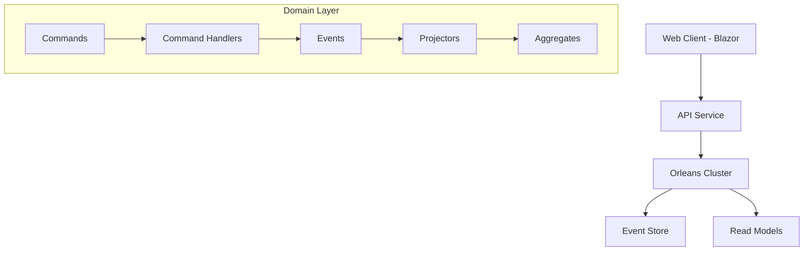
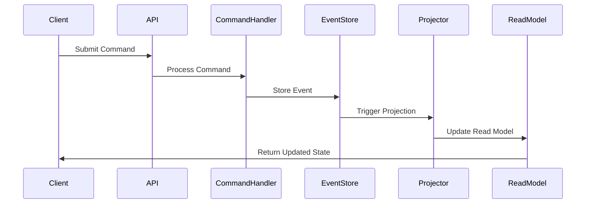

# System Patterns: School Management System

## Architecture Overview

The School Management System is built on an event-sourced architecture using the Sekiban framework, with a distributed computing model powered by Orleans. This architecture provides strong consistency, auditability, and scalability.



## Core Architectural Patterns

### 1. Event Sourcing

The system uses event sourcing as its fundamental data persistence pattern, storing all state changes as immutable events rather than just the current state.

**Implementation Details:**
- All state changes are captured as immutable event records
- Events are stored in chronological order in the event store
- Current state is derived by replaying events
- Events serve as the source of truth for the system
- Provides complete audit history and temporal queries

**Key Components:**
- `IEventPayload` interface for all domain events
- Event classes using record types for immutability
- Event metadata handling through Sekiban

### 2. Command-Query Responsibility Segregation (CQRS)

The system separates write operations (commands) from read operations (queries) for better scalability and performance.

**Implementation Details:**
- Commands represent user intentions and result in state changes
- Queries retrieve data without modifying state
- Different models for write and read operations
- Optimized read models for specific query scenarios

**Key Components:**
- `ICommandWithHandler<TCommand, TProjector>` for command handling
- `IMultiProjectionListQuery<TProjection, TQuery, TResult>` for list queries
- `IMultiProjectionQuery<TProjection, TQuery, TResult>` for non-list queries

### 3. Domain-Driven Design (DDD)

The system employs domain-driven design principles to model the complex relationships and business rules of a school management system.

**Implementation Details:**
- Aggregates as consistency boundaries (Student, Teacher, Class)
- Value objects for immutable concepts
- Domain events representing business facts
- Rich domain model with encapsulated business logic

**Key Components:**
- Aggregate classes implementing `IAggregatePayload`
- Projectors implementing `IAggregateProjector`
- Domain events representing business facts
- Commands representing user intentions

### 4. Actor Model (via Orleans)

The system uses the actor model through Orleans to handle concurrency and distribution.

**Implementation Details:**
- Grain-based processing for scalable, distributed computing
- Virtual actors that exist in memory only when needed
- Location transparency for distributed processing
- Automatic activation and deactivation of actors

## Domain Model

### Aggregates

1. **Student**
   - Core entity representing a student in the school
   - Properties: Name, StudentId, DateOfBirth, Email, PhoneNumber, Address, ClassId
   - States: Active (Student) or Deleted (DeletedStudent)

2. **Teacher**
   - Core entity representing a teacher in the school
   - Properties: Name, TeacherId, Email, PhoneNumber, Address, Subject, ClassIds
   - States: Active (Teacher) or Deleted (DeletedTeacher)

3. **Class**
   - Core entity representing a class in the school
   - Properties: Name, ClassCode, Description, TeacherId, StudentIds
   - States: Active (Class) or Deleted (DeletedClass)

### Relationships

```mermaid
erDiagram
    TEACHER ||--o{ CLASS : teaches
    CLASS ||--o{ STUDENT : contains
    STUDENT }o--|| CLASS : enrolled_in
```

1. **Teacher-Class Relationship**
   - One-to-many: A teacher can teach multiple classes
   - Classes reference their teacher by TeacherId
   - Teachers track their classes via ClassIds list

2. **Class-Student Relationship**
   - One-to-many: A class can have multiple students
   - Classes track their students via StudentIds list
   - Students reference their class by ClassId

## Event Flow



1. **Command Processing**
   - Commands are submitted through the API
   - Command handlers validate and process commands
   - Events are generated based on command processing
   - Events are stored in the event store

2. **Projection Processing**
   - Events trigger projectors to update aggregate state
   - Projectors apply events to aggregates
   - Read models are updated based on new aggregate state
   - Queries use read models to retrieve data

## Query System

The system implements two types of queries:

1. **List Queries**
   - Return collections of items
   - Support filtering and sorting
   - Examples: StudentQuery, TeacherQuery, ClassQuery

2. **Non-List Queries**
   - Return single results
   - Used for specific lookups or checks
   - Examples: StudentByIdQuery, ClassByIdQuery

## Technical Patterns

1. **Immutable Data**
   - C# record types for immutable data structures
   - With-expressions for non-destructive updates
   - Pattern matching for state transitions

2. **Pattern Matching**
   - Extensive use of pattern matching in projectors
   - Type-based dispatch for event handling
   - Tuple patterns for state transitions

3. **Result Handling**
   - ResultBox pattern for error handling
   - Explicit success/failure return values
   - Consistent error propagation

4. **Serialization**
   - JSON serialization for events and commands
   - Source generation for AOT compilation
   - Explicit serialization context
